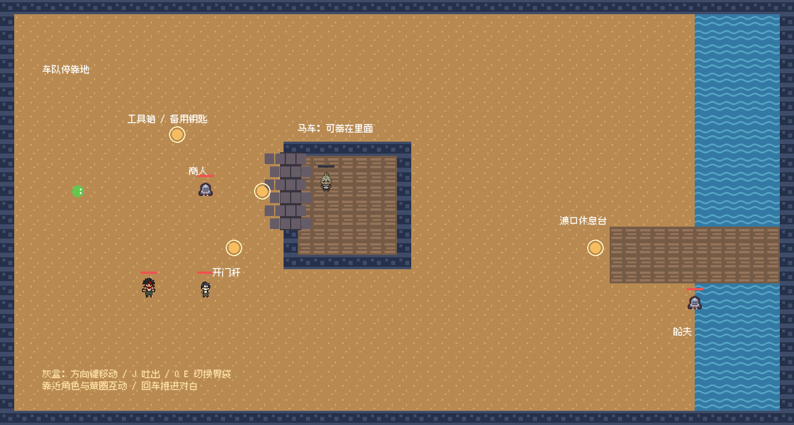
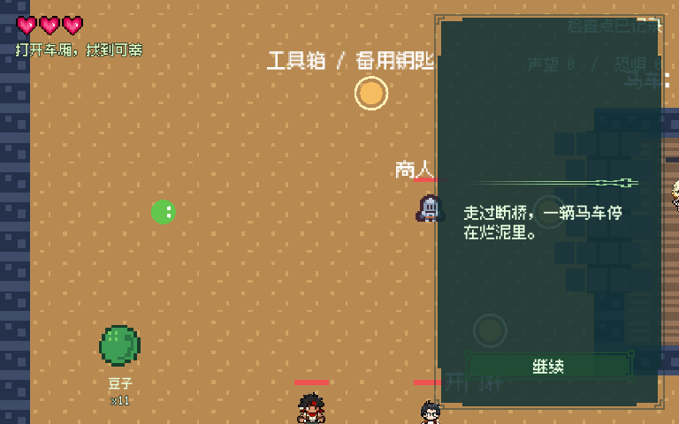

# 第二章 C2A 试玩审阅

2026-10-04 更新。本轮完成主线灰盒及制作人要求的分支闭环审计，停止线是制作人试玩；未进入支线、完整地图和最终美术。审阅分支：`codex/chapter2-mainline-slice`，主线基线 `9347a86`。新增问题、复现与证据见 `CHAPTER2_BRANCH_AUDIT.md`。

## 启动

本机可双击项目上级目录的 `试玩第二章.cmd`。也可在 Godot 4.7.2 编辑器中打开 `game/chapter2_preview.tscn`，按 F6 运行当前场景。

专用试玩入口使用独立存档目录，不覆盖第一章存档。该入口给出已相识且非敌对的巴克/米罗与 14 节蛇身，方便检查互动；正常游戏入口沿用自己的历史。正式入口在森林断桥之后，必须先完成放桥。

方向键移动（同方向长按加速），靠近人物或黄圈触发互动，回车推进对白，上下选择；J 吐出，Q/E 切换胃袋，F5 保存，F6 读取，F9 回到地图检查点。

## 建议试玩

1. 向商人交涉或威胁，拉车侧开门杆，找到昏迷可蒂。
2. 或先吞掉/击晕商人，再从工具箱拿备用钥匙，照常开门。
3. 选择担架或“吞下保护”，从车门原路出来，绕车下方去右边渡口。
4. 靠近休息台安置可蒂，舔脸或舔脚叫醒；再靠近她，选“一起走”。
5. 可试途中存读档、满胃、普通吞人、再次击晕和唤醒。旧乘客可在休息台下蛇；他保留身份和 HP。

本切片尚无第三章入口或完整双人行动控制。结伴约定是本章完成事件，之后的同行玩法留给下阶段。

## 已验证

| 门禁 | 结果 |
| --- | --- |
| 第二章组合与异常操作 | 1579 项通过，120 组核心组合，含载运读档后的真实接触与射击 |
| 第二章定向与真实按键 | 157 项通过，四条完整实操；新增击晕商人/钥匙/担架/舔脚 CG |
| 原有序章、第一章、UI/HUD 回归 | `tests/run_tests.gd` 通过 |
| 上轮合并反馈 | `tests/merge_feedback_tests.gd` 通过 |
| CG 回归 | `tests/cg_tests.gd` 通过 |
| 音频生命周期 | `tests/audio_architecture_tests.gd` 通过，0 项跳过 |
| 脚本全量校验 | 89 个通过 |
| 灰盒地图与试玩场景 | 静态校验和 preflight 均通过，诊断为空 |
| 原生渲染检查 | 地图总览、开场对白已截图并检查 |

计分、转移途中读档、旧乘客和旧 NPC 连续性、任务防重复都由正式状态/存档路径验证。真实按键测试通过输入派发、碰撞和对白选择完成任务，没有用内部函数代替营救结算。单元部分另检查容量、敌意和保存边界。

Windows 上 GDA 的 live daemon 不支持本平台，所以真实输入使用项目内 Godot TestArena 路径；脚本、场景和 preflight 仍使用 GDA。

## 重要修复与限制

- 先捕获旧地图，再迁移角色，防止旧 NPC 位置覆盖新章迁移。
- 吐出时保留角色历史字段；唤醒保留敌意与受袭记录；第二章全体实体的战败模式为击晕。
- 担架读档恢复真实昏迷，不提前唤醒。胃袋满不提交角色或计分变化。
- 空中吐出后存档、动态旧角色落地/下蛇后读档，不再丢人；担架与胃袋读档后的接触/受伤信号会重新绑定。重复安置不让清醒可蒂重新昏迷。
- 担架的下蛇选项可用，蛇背占位时会提示先让乘客下来；转场期间阻止混合状态存档和重复读档/重试。
- 声望只在清醒结伴时发放一次，恐惧按固定遭遇事件防重复，两值分别保存。
- 商人/船夫暂用既有占位小人，可蒂舔脚 CG 暂用共用人类脚素材；地图为功能灰盒。
- “以后任务受声望/恐惧影响”的数据已具备，具体后续任务尚未实现。没有为此加入派系、目击或复杂联动。
- `.dialogue` 为本章唯一对白正文，采用现有 runner 的 JSON 数据格式；已加入导出包含规则。
- 真正死亡的旧可蒂不复活；该旧分支会明确拒绝本救援切片。

